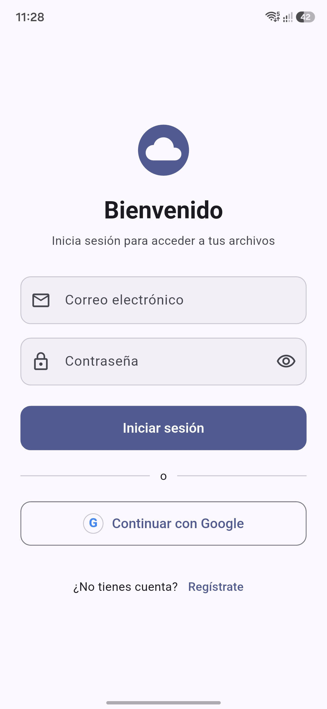
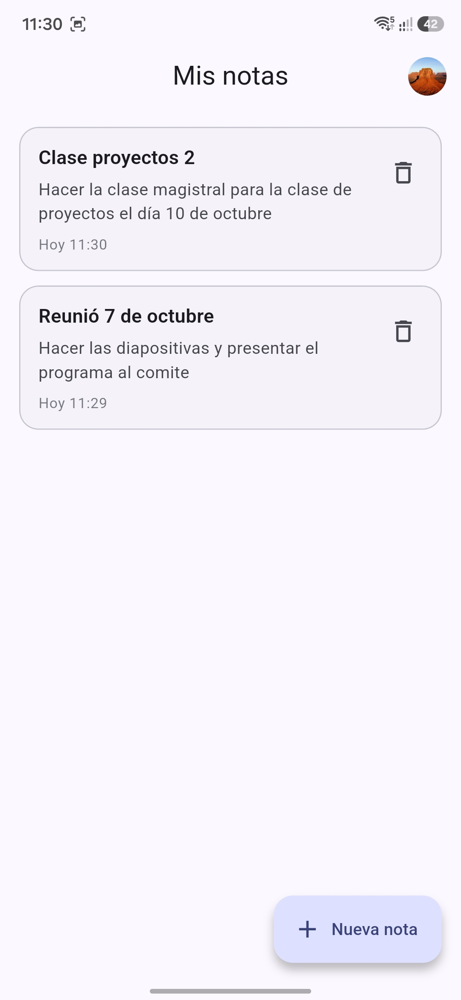
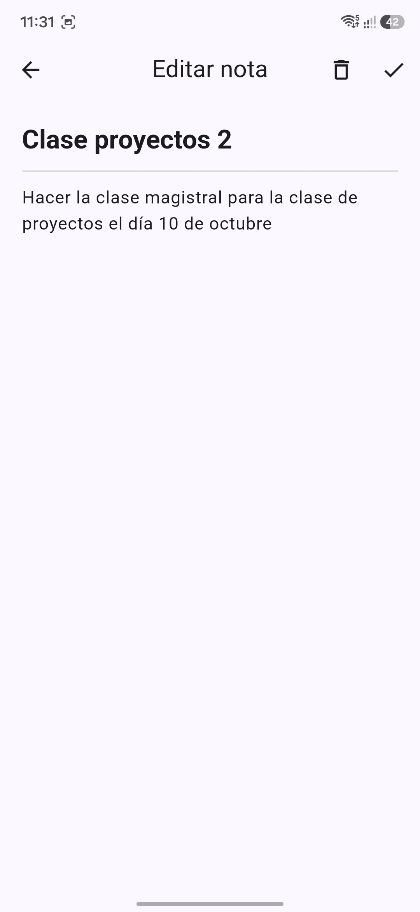

# Mis notas: Flutter + Firebase Authentication + Cloud Firestore

Proyecto de ejemplo para la exposición **"Firebase Base: Autenticación y Cloud Firestore (CRUD básico)"**.

Es una app tipo cuaderno digital: cada persona se registra o inicia sesión y gestiona **sus propias notas** (crear, leer, editar y eliminar). Sirve como plantilla para que la clase reutilice el patrón de autenticación y base de datos por usuario.

| Paquete | Para qué se usa en el proyecto |
|---|---|
| `firebase_core` | Inicializar Firebase |
| `firebase_auth` | Registro, login (correo y Google), sesión persistente y cierre de sesión |
| `cloud_firestore` | Guardar y sincronizar las notas en tiempo real |
| `google_sign_in` (7.x) | Login con Google en Android |
| `provider` | Gestión de estado |
| `go_router` | Navegación y protección de rutas (Auth Guard) |

## Capturas de pantalla
| Login | Lista de notas | Editor |
|---|---|---|
|  |  |  |

## Funcionalidades

- Registro con correo, contraseña y nombre opcional.
- Login con correo y contraseña, y con cuenta de Google.
- Sesión persistente: al reabrir la app el usuario sigue dentro.
- CRUD de notas con lista en tiempo real, ordenada por última edición.
- Confirmación antes de eliminar y aviso de cambios sin guardar.
- Aislamiento por usuario: cada cuenta ve solo sus notas.
- Mensajes de error en español y tema claro/oscuro automático.

## Cómo conectan las dos dependencias

El `uid` que entrega **Firebase Authentication** define la ruta donde **Cloud Firestore** guarda los datos de cada usuario:

```
users/{uid}/notes/{noteId}
    title:     String
    content:   String
    createdAt: Timestamp (lo pone el servidor)
    updatedAt: Timestamp (lo pone el servidor)
```

Las reglas de seguridad de Firestore comprueban que `request.auth.uid` coincida con el `uid` de la ruta.

Flujo de datos: `Pantalla → Provider → Service → Firebase`. Solo los servicios (`AuthService` y `NoteService`) conocen los SDK de Firebase.

---

# Instrucciones paso a paso

> **Importante:** este repositorio **no incluye** los archivos de configuración de Firebase (`lib/firebase_options.dart` y `android/app/google-services.json`). Están en `.gitignore` porque pertenecen a cada proyecto de Firebase. Cada persona debe generarlos con **su propio proyecto** siguiendo los pasos 3 y 4. Sin ellos, el proyecto **no compila**.

## 1. Requisitos

- [Flutter SDK](https://docs.flutter.dev/get-started/install). Probado con Flutter 3.47 y Dart 3.13. Verifica con `flutter doctor`.
- Android Studio con el SDK de Android y un emulador **con imagen "Google Play"** (o un teléfono con depuración USB).
- [Node.js](https://nodejs.org) (LTS), necesario para Firebase CLI.
- Una cuenta de Google para usar Firebase.

Instala las herramientas de Firebase:

```bash
npm install -g firebase-tools
firebase login
dart pub global activate flutterfire_cli
```

Asegúrate de que la carpeta de ejecutables de Dart esté en tu `PATH` (en Windows suele ser `%LOCALAPPDATA%\Pub\Cache\bin`; en macOS/Linux, `~/.pub-cache/bin`).

## 2. Clonar el repositorio

```bash
git clone https://github.com/CrissCB/App-Flutter-with-Firebase.git
cd App-Flutter-with-Firebase
flutter pub get
```

## 3. Crear tu proyecto en Firebase

En la [consola de Firebase](https://console.firebase.google.com):

1. **Add project** y ponle un nombre.
2. **Authentication → Sign-in method**: habilita **Correo/contraseña** y **Google** (en Google, elige un correo de soporte).
3. **Firestore Database → Create database**: elige una ubicación y empieza en modo de prueba. Luego aplica las reglas del paso 5.

No necesitas activar Cloud Storage ni el plan Blaze: el proyecto solo usa Authentication y Firestore, disponibles en la capa gratuita (plan Spark). Verifica los límites vigentes en la documentación de Firebase.

## 4. Conectar la app con tu proyecto

Desde la carpeta del proyecto:

```bash
flutterfire configure
```

Selecciona tu proyecto y marca la plataforma **android**. Esto genera:

- `lib/firebase_options.dart`
- `android/app/google-services.json`

Si cambias el `applicationId` de la app, hazlo **antes** de ejecutar este comando. El valor actual está en `android/app/build.gradle.kts`.

## 5. Reglas de seguridad de Firestore

En Firebase Console → Firestore Database → **Rules**, pega y publica:

```
rules_version = '2';
service cloud.firestore {
  match /databases/{database}/documents {
    match /users/{uid}/notes/{noteId} {
      allow read, write: if request.auth != null && request.auth.uid == uid;
    }
  }
}
```

Cada usuario solo puede leer y escribir dentro de su propia carpeta. El modo de prueba de Firestore vence a los 30 días; estas reglas no.

## 6. Configurar Google Sign-In en Android

El login con **correo y contraseña funciona sin este paso**. Solo Google lo necesita.

1. **Obtener las huellas SHA** de tu keystore de depuración. Desde la carpeta `android`:
   ```bash
   # Windows
   gradlew signingReport
   # macOS / Linux
   ./gradlew signingReport
   ```
   Copia **SHA-1** y **SHA-256** de la variante `debug`.
2. En Firebase Console → Configuración del proyecto → Tus apps → app Android → **Agregar huella digital**. Pega ambas.
3. **Vuelve a descargar `google-services.json`** (o repite `flutterfire configure`) y reemplaza el archivo en `android/app/`. Debe tener una entrada en `oauth_client` con `"client_type": 1`.
4. Copia tu **Web client ID**: Firebase Console → Authentication → Sign-in method → Google → *Web SDK configuration*. Pégalo en `lib/features/auth/data/services/auth_service.dart`:
   ```dart
   static const String? _serverClientId =
       'TU_WEB_CLIENT_ID.apps.googleusercontent.com';
   ```
5. En el emulador, agrega una cuenta de Google (Ajustes → Cuentas).

> Cada computador tiene su propio keystore de depuración, así que cada persona debe registrar **su** SHA-1.

## 7. Ejecutar

```bash
flutter devices
flutter run -d <id_del_dispositivo>
```

Cuando termine de compilar, prueba en este orden:

1. Regístrate con correo y contraseña. Debe llevarte a la lista de notas.
2. Crea una nota con el botón **Nueva nota**.
3. Edítala y guarda: sube al primer lugar.
4. Elimínala (papelera, deslizando o desde el editor).
5. Cierra sesión y vuelve a entrar con Google.
6. Revisa en Firebase Console → Authentication y Firestore que aparecen el usuario y la nota.
7. Entra con una segunda cuenta y comprueba que no ve las notas de la primera.

---

## Estructura del proyecto

Organización por funcionalidades (*feature-first*), con tres capas en cada una:

```
lib/
├── main.dart                     # Arranque, providers y router
├── firebase_options.dart         # Generado por FlutterFire (no se sube)
├── core/
│   ├── routes/app_router.dart    # Rutas + Auth Guard
│   ├── theme/app_theme.dart      # Tema claro/oscuro
│   └── widgets/                  # Botón y spinner reutilizables
└── features/
    ├── auth/
    │   ├── data/
    │   │   ├── models/user_model.dart
    │   │   └── services/auth_service.dart      # firebase_auth
    │   └── presentation/
    │       ├── providers/auth_provider.dart
    │       ├── screens/ (login_screen, register_screen)
    │       └── widgets/google_sign_in_button.dart
    └── notes/
        ├── data/
        │   ├── models/note_model.dart
        │   └── services/note_service.dart      # cloud_firestore
        └── presentation/
            ├── providers/note_provider.dart
            ├── screens/ (home_screen, note_editor_screen)
            └── widgets/note_card.dart
```

## Dónde mirar el código de cada dependencia

| Qué quieres ver | Archivo |
|---|---|
| Registro, login, Google y `authStateChanges()` | `lib/features/auth/data/services/auth_service.dart` |
| Cómo se observa la sesión y se traducen los errores | `lib/features/auth/presentation/providers/auth_provider.dart` |
| Redirección según la sesión (Auth Guard) | `lib/core/routes/app_router.dart` |
| CRUD y `snapshots()` de Firestore | `lib/features/notes/data/services/note_service.dart` |
| Timestamps del servidor y conversión de documentos | `lib/features/notes/data/models/note_model.dart` |
| Vínculo entre el `uid` y la escucha de Firestore | `lib/features/notes/presentation/providers/note_provider.dart` |

## Llamadas principales a Firebase

| Operación | Llamada |
|---|---|
| Registro | `createUserWithEmailAndPassword()` |
| Login con correo | `signInWithEmailAndPassword()` |
| Login con Google (Android) | `GoogleSignIn.authenticate()` → `signInWithCredential()` |
| Observar sesión | `authStateChanges()` |
| Cerrar sesión | `signOut()` |
| Leer en tiempo real | `collection(...).orderBy('updatedAt').snapshots()` |
| Crear | `collection(...).add()` |
| Actualizar | `doc(id).update()` |
| Eliminar | `doc(id).delete()` |

## Solución de problemas

| Síntoma | Causa probable |
|---|---|
| `Target of URI doesn't exist: 'firebase_options.dart'` | Falta ejecutar `flutterfire configure` (paso 4) |
| `File google-services.json is missing` al compilar | Falta `android/app/google-services.json` (paso 4) |
| Google sale como "cancelado" sin cancelar, o error `DEVELOPER_ERROR` (código 10) | Falta registrar SHA-1/SHA-256, `google-services.json` desactualizado o falta `_serverClientId` (paso 6) |
| No aparece ninguna cuenta de Google | El emulador no tiene imagen "Google Play" o no tiene cuenta agregada |
| `permission-denied` en la lista de notas | Reglas de Firestore sin aplicar o distintas a las del paso 5 |
| `operation-not-allowed` | No está habilitado Correo/contraseña o Google en Authentication |
| `ProviderNotFoundException` | Se hizo hot reload; usa hot restart (`R`) |
| Spinner infinito en la lista | Firestore no está creado en la consola |

## Notas y limitaciones

- **Plataformas:** probado en **Android**. La estructura permite ejecutarlo en web, pero no es el foco de este ejemplo. **iOS no está probado**; requeriría `GoogleService-Info.plist` y el URL scheme de Google en `Info.plist` (pendiente de verificar).
- **Pantalla roja breve al eliminar deslizando:** en modo debug, `Dismissible` puede mostrar un error momentáneo si la tarjeta no sale del árbol de widgets al instante. El proyecto lo evita quitando la nota de la lista local antes de confirmar el borrado en Firestore (borrado optimista).
- **Escrituras sin conexión:** Firestore guarda los cambios en caché local y los sincroniza al reconectar.

## Relevancia con IA

El patrón `users/{uid}/...` es el mismo que se usaría para guardar el historial de un chatbot, la memoria o preferencias de un asistente, o el consumo de una API de IA por usuario, con los datos protegidos por reglas de seguridad. Son ideas de aplicación: este proyecto implementa solo el CRUD de notas.

## Mejoras futuras

- Recuperación de contraseña (`sendPasswordResetEmail`) y verificación de correo.
- Búsqueda, etiquetas, colores y notas fijadas.
- Paginación si el número de notas crece mucho.
- Pruebas automatizadas de servicios y providers.

## Licencia

Proyecto con fines educativos.
